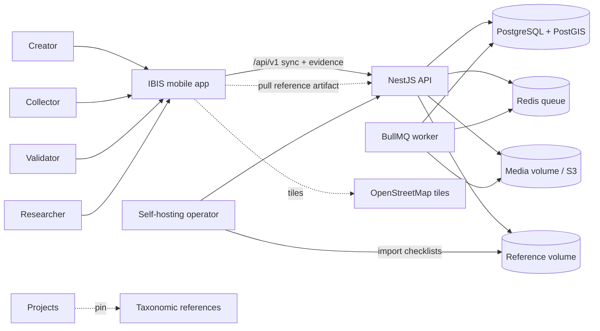
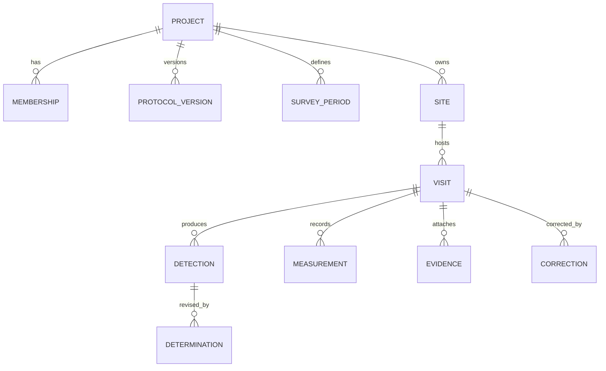
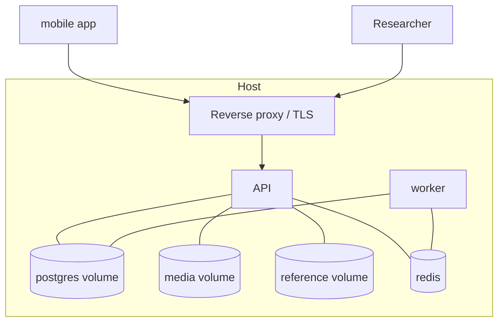

# Architecture: IBIS — Integrated Biodiversity Inventory Survey

## Business context

IBIS turns a project's protocol into the default field workflow: a creator
defines a Project, its Protocol versions, Survey periods, Sites and Target
list; collectors capture Visits offline and submit them; submitted Visits are
immutable and change only through Corrections; validators may validate them;
researchers export occupancy- and GBIF-ready data. A creator may work with no
account — creating a Project and capturing Visits locally — and sign up later,
linking that local data to the new account. Capture is decoupled from
taxonomic resolution: Visits may be captured with provisional taxa and
resolved before submission (ADR-0019). Recurring vocabulary is defined in
`GLOSSARY.md` and the model in `DOMAIN.md` — this document maps them onto
modules and persistence, and never restates them.

## Quality attributes

Ranked; the top one breaks ties everywhere below.

1. **Offline reliability & data integrity** — no Visit or Detection is lost on the device, and submitted data stays trustworthy and auditable.
2. **Non-devops deployability & operability** — the whole server is one Compose stack an operator can run and upgrade.
3. **Field performance & battery on low-end devices** — the capture loop stays responsive during long sessions.
4. **Privacy & security** — collector data is personal data (GDPR) and sensitive-taxa locations are a conservation risk.

## Assumptions & constraints

- One developer, one repository; a self-hosted single-host deployment.
- Devices are offline for whole days; the server may be one release behind the app.
- Low-end Android has no barometer: every sensor-backed field falls back to manual entry.
- Protocol definition is shared across Dart and TypeScript (ADR-0009).
- Postgres 18 + PostGIS, Redis, and Node; media on a volume with optional S3 (ADR-0007).
- Taxonomic-reference artifacts are operator-supplied files on a server volume and cached on the client; the server need not reach the internet (ADR-0020).

## System view

A Flutter client talks to a self-hosted NestJS modular monolith over a
versioned REST sync API. The same server image also runs as a BullMQ worker
consuming Export jobs from Redis. Postgres/PostGIS is the system of record;
evidence files live in a volume or an optional S3 backend. Versioned
Taxonomic-reference artifacts live on a server volume, are served by the API,
and are pulled and cached by the client for offline taxon resolution.



## Module map (container view)

Each module names the `DOMAIN.md` aggregates it owns; an aggregate has exactly
one owner. Client modules own no **server-authoritative** aggregate; a
locally-created Project (until linked), an in-progress Visit, and a
field-created Site exist on the device until linked or submitted.

### Client — `app/` (Flutter)

| Module | Responsibility | Interface | Owns |
|---|---|---|---|
| `shell` | App shell with project-scoped routing (Projects at the top level, Account in the app bar) and the persistent system-state indicator; design tokens, Riverpod wiring (the foundational Epic) | navigation + theme providers | — |
| `identity` | Better Auth client; current person and their project roles | sign-in/out, session | — |
| `projects` | Own the local Project aggregate: create and edit Project config offline with no account (create takes only a name; the pinned reference and settings are set afterward), pull/join existing Projects, and the Project cards/description — Protocol version, Survey periods, Target list, Sites | config + creation providers | local Project (until linked) |
| `taxonomy` | Built-in Taxonomic-reference catalogue and per-group default; the pulled versioned artifact cache; offline taxon resolution against the Project's pinned reference | catalogue + resolution providers | — |
| `analyses` | Own the built-in Analysis spec catalogue and a Project's objective + selected spec; gate and warn the Protocol design against the spec's required data shape, and run the pre-export readiness check | analysis providers | — |
| `capture` | Offline Visit capture loop: effort timer, per-target Detection entry, opportunistic taxa (provisional until resolved), covariates, end Visit | Visit state notifiers | in-progress Visit (local) |
| `sites` | Site list/map display and field Site creation, inside a Project | site editor | field-created Site (local) |
| `help` | In-app manual explaining the core field journey (UX-023) | help screen | — |
| `store` | drift database, schema, forward-only migrations | DAOs | local SQLite schema |
| `sensors` | sensors_plus / geolocator / record / image_picker wrappers + Provenance | measurement/evidence services | — |
| `outbox` | Submission upload, retry/backoff, config pull, and the link/upload of locally-created Projects and their Visits on sign-up | sync orchestration | — |

### Server — `server/` (NestJS, REST)

| Module | Responsibility | Public interface | Owns |
|---|---|---|---|
| `identity` | Better Auth integration; resolves person and Memberships | auth guard, `@CurrentPerson()` | — |
| `projects` | Project setup and config for sync; `POST /projects` takes an optional client-supplied id (idempotent) so a locally-created Project links under its own identity; the pinned Taxonomic reference is optional and set later | `/projects`, `/protocol-versions`, `/survey-periods` | Project (with Membership, ProtocolVersion, SurveyPeriod, Target list, settings, pinned TaxonomicReference) |
| `taxonomic-references` | Serve immutable, versioned Taxonomic-reference artifacts imported by the operator; no runtime aggregate | `/taxonomic-references` | — |
| `sites` | Site lifecycle | `/sites` | Site |
| `visits` | Idempotent ingest, immutability, corrections, validation; ingest rejects a Visit whose Project has no pinned reference or whose Detections do not resolve (INV-006, INV-008) | `/visits`, `/visits/:id/corrections` | Visit (with Detection, Determination, Measurement, Evidence metadata, Correction) |
| `media` | Evidence storage abstraction and upload/download | `/media` | — |
| `exports` | Detection-history matrix, Darwin Core, CSV, GeoPackage, and the analysis bundle (occasion-covariate table, data dictionary, generated methods paragraph, runnable recipe) as queue jobs | `/exports` | — |
| `sync` | The versioned transport | `/api/v1/*` controllers | — |
| `worker` | Same image, BullMQ consumer for `exports` | queue consumer | — |

### Shared — `packages/protocol/` (TypeScript + Dart codegen)

Protocol definition format: TS types + JSON Schema, generated Dart, and golden
fixtures. No runtime aggregate.

### Shared — `packages/analysis/` (TypeScript + Dart codegen)

Analysis spec format: TS types + JSON Schema, generated Dart, and golden
fixtures for the built-in specs. Declarative data, no runtime aggregate and no
executable code (INV-018).

## Data model

Persistence per aggregate; enforcement locus is recorded per `INV-` in
`DOMAIN.md`. Structural rules are Postgres constraints; rule-heavy rules run
in server code inside a transaction (ADR-0010).



- **Project** → `project` (nullable `description`, nullable `objective`, selected `analysis_spec_id` + `analysis_spec_version`, settings jsonb, pinned taxonomic-reference id + version — both nullable until chosen), `membership`, `protocol_version` (document jsonb, `frozen_at`), `survey_period`. The `project.id` is the client-assigned UUIDv7 for a locally-created Project, or the server-generated id for one created online (ADR-0014). The selected Analysis spec is resolved from the built-in catalogue; no spec is stored per Project (INV-018).
- **Site** → `site` with `geom geometry(Geometry, 4326)` and `origin` enum; `site_measurement` for site covariates.
- **Visit** → `visit` (project/site/survey_period/protocol_version FKs, `state` enum, effort jsonb, timestamps, validation fields); `detection` (unique per target taxon per Visit, `opportunistic` flag); `determination` (`replaces_id` self-reference for append-only revisions); `measurement` (value, unit, `provenance` jsonb, owner = visit or detection); `evidence` (storage key + `sha256`, immutable); `correction` (author, reason, payload jsonb, append-only). The `visit.taxonomic_reference_id`/`version` columns stay `NOT NULL`: ingest copies the Project's pin, and the guard rejects a Visit before that copy when the Project has none (INV-008).
- **Constraints**: FKs, `state` enums, `CHECK` on non-negative counts, `ST_IsValid`/SRID checks, partial unique index `(visit_id, taxon_ref) WHERE NOT opportunistic`.
- **Immutability & append-only** (INV-001, INV-009): no UPDATE path for a submitted Visit, Determination or Correction in application code.
- **Provenance** (INV-010): `provenance.method` NOT NULL whenever a `measurement` row exists.
- **Sensitive coordinates** (INV-011): true geometry is stored; obfuscation happens in the read/export layer, never in storage.
- **Client local store** (drift, ADR-0002): owns one local **Project** aggregate — `projects` with its `protocol_versions`, `survey_periods`, and `sites` — populated by offline creation and the config pull alike; there is no separate pull-cache copy. `projects` also carries the synced `description`, `objective`, selected Analysis spec id/version, and the pinned reference (nullable until chosen). A locally-created Project keeps its client-assigned identity when linked (INV-015). A separate cache holds the pulled Taxonomic-reference artifact — `taxonomic_references` (id, version, label, taxon group) and its taxa (reference id+version, abbreviation, name) — and a Detection is **provisional** when the Project has no pin or its stored taxon key does not resolve against that cache; provisional status is derived, not stored.
- **Reference volume** → operator-supplied versioned reference artifacts, indexed and served by `taxonomic-references`; never stored in Postgres.
- **Auth tables** are owned by Better Auth, co-located in Postgres via Drizzle.

## Compatibility surfaces

| Surface | Paths | Other side & skew tolerated | Rule | Proof owed |
|---|---|---|---|---|
| Sync REST API | `server/src/sync/**`, `app/lib/outbox/**` | app ↔ server; server may be one release behind | `/api/v1`, additive only, unknown fields ignored | contract tests both sides (OpenAPI + client) |
| Projects API | `server/src/projects/**`, `app/lib/projects/**` | app ↔ server | additive; `POST /projects` accepts an optional client-supplied id (idempotent create-or-return); a nullable `description` and a nullable pinned Taxonomic reference are additive | contract tests both sides |
| Taxonomic reference artifact | `server/src/taxonomic-references/**`, `app/lib/taxonomy/**` | app ↔ server; app may pin a version the server still holds | versioned per `id`+`version`, immutable once served, additive | golden fixture of an artifact + client parse test |
| Protocol format | `packages/protocol/**` | app ↔ server | versioned; additive changes extend; Project pins a version | golden fixtures validated in Dart and TS |
| Analysis spec format | `packages/analysis/**` | app ↔ server | versioned; additive changes extend; specs are declarative data (INV-018) | golden fixtures validated in Dart and TS |
| Client schema | `app/lib/store/**` | device upgrades | forward-only migrations | migration test from each prior version |
| Server schema | `server/drizzle/**` | operator upgrades | forward-only migrations | migration test on a populated DB |
| Export formats | `server/src/exports/**` | analysts, GBIF | stable per format version; additive columns; the analysis bundle is versioned with its spec | golden fixtures |
| Media | `server/src/media/**` | volume/S3 | content-hashed keys, never mutated | upload + hash test |

## Key flows

**Authentication.** The client signs in against Better Auth; the API resolves
the person and their Memberships on every request via the auth guard. Roles
are project-scoped, never global. Signing in is never required to create a
Project or capture a Visit (INV-016).

**Taxonomic-reference provisioning.** The operator places versioned reference
files on the server volume; `taxonomic-references` indexes and serves them
immutably. The client picks a reference (suggested per-group default, or the
built-in catalogue) and pulls the pinned version into its local cache (ADR-0020).

**Accountless journey.** A creator with no account creates a Project locally
by name (client-assigned UUIDv7 identity, INV-015) and captures Visits
offline; a Visit needs only a Site, and its Detections may hold provisional
taxa. The Project's Protocol version, Survey periods, Sites and pinned
reference are defined when ready, the reference artifact is pulled, taxa are
resolved, and only then does the outbox submit. Nothing reaches the server
before that.

**Onboarding.** On first launch, with no Project yet, the Projects list shows
an empty state with a create action (`projects` module) and a link into the
streamlined in-app manual (`help` module, UX-023). Creating a Project is a
guided form with inline validation and explanatory help on the non-obvious
fields; the client never seeds a Project of its own.

**Analysis-driven design and export.** A creator records an objective and
selects an Analysis spec (`analyses` module). The spec's required data shape is
surfaced as hard gates and warnings while the Protocol is defined, and again as
a pre-export readiness check: a hard gate blocks the analysis bundle and
submission, never capture. Export generates the bundle — detection-history matrix,
occasion-covariate table, data dictionary, generated methods paragraph and a
runnable R recipe — which the researcher runs externally (INV-018).

**Link journey.** On sign-up, the client outbox links the local data:
`POST /projects` with the client id creates the Project server-side and a
single creator Membership (INV-014, INV-016), the config uploads, then the
Visits submit idempotently on their UUIDv7 ids.

```mermaid
sequenceDiagram
  participant C as App
  participant S as Server
  C->>C: create Project by name (client id)
  C->>C: capture Visits offline (Site only; provisional taxa)
  C->>C: person defines Protocol + pins reference
  C->>S: pull reference artifact (pinned version)
  C->>C: resolve taxa; submission unblocked
  C->>C: person signs up
  C->>S: POST /projects (client id, idempotent) → creator Membership
  C->>S: upload Protocol version / Survey periods / Sites
  C->>S: submit Visits (idempotent, UUIDv7, resolved)
  S-->>C: linked
```

**Primary journey (linked project).**

```mermaid
sequenceDiagram
  participant C as Collector (app)
  participant S as Server
  participant Q as Redis/worker
  C->>S: pull config since token (incl. pinned reference)
  C->>S: pull reference artifact for the pinned version
  S-->>C: project, protocol version, sites, target list, taxa
  C->>C: capture Visit offline (effort, detections, evidence)
  C->>C: end Visit; resolve any provisional taxa
  C->>S: submit Visit (idempotent, UUIDv7)
  S->>S: guard the pinned reference, enforce invariants, store immutable Visit
  S-->>C: accepted
  Note over S: validator validates or issues a Correction
  S->>Q: enqueue export
  Q-->>C: export artifact (matrix / Darwin Core / GeoPackage)
```

## Cross-cutting concerns

- **Error handling**: one error shape on the API; the client outbox retries with backoff and is idempotent on UUIDv7 ids (ADR-0011), including the link upload.
- **Taxon resolution**: client-side against the cached artifact; the server enforces the pinned reference and resolved taxa at submission (INV-006, INV-008).
- **Logging/observability**: structured logs; `GET /healthz` (liveness) and `/readyz` (DB + Redis); queue depth visible to the operator.
- **Config/environments**: environment variables via Compose — DB/Redis URLs, Better Auth secret, optional S3 keys, tile URL, reference-volume path.
- **Security boundaries**: internet → API (TLS terminated by the operator's reverse proxy), API → Postgres/Redis internal only; authn via Better Auth, authz via project Membership; sensitive coordinates obfuscated before leaving the server (INV-011).

## Deployment view

- **Local dev**: `docker compose up` (Postgres/PostGIS, Redis, server, worker) plus the Flutter app on a device/emulator.
- **Production (self-hosted)**: one Linux host running the Compose stack from GHCR images, with persistent volumes for the database, media and reference artifacts and an operator-provided reverse proxy for TLS; optional MinIO for S3.



## Operational view

- **Observability**: health endpoints and logs only; no external APM at v1.
- **Incident handling**: restart the stack; failed export jobs are retried from Redis.
- **Reference import**: the operator places versioned checklist files on the reference volume; the server indexes and serves them (ADR-0020).
- **Backup/recovery**: documented `pg_dump`/`pg_restore` and a media-volume snapshot, with a restore procedure in the operator docs.
- **Capacity**: sized for a project-scale single host; revisit at media or visit-volume thresholds.

## Key decisions

- Modular monolith NestJS plus a BullMQ worker for Exports (ADR-0008).
- Protocol format shared through `packages/protocol` with Dart codegen (ADR-0009).
- Invariants: DB constraints where cheap, application rules for the rest, minimal triggers (ADR-0010).
- Versioned additive `/api/v1`, idempotent UUIDv7 submission, append-only corrections (ADR-0011).
- Evidence uploaded through the API, presigned S3 when configured (ADR-0012).
- Hosting via Docker Compose + GHCR (ADR-0006); storage volume by default with optional S3 (ADR-0007).
- Local-first Projects: client-assigned identity, linked on sign-up (ADR-0014).
- Project-scoped client navigation: Projects at the top level, a Project the hub for its Sites, Visits and config (ADR-0015).
- First-run onboarding without a seeded Example Project: an empty state plus a guided create form, with the optional synced Project `description` and the in-app manual retained (ADR-0017).
- Declarative Analysis spec catalogue: specs are data, analysis runs externally and never in-app (ADR-0018).
- Capture decoupled from taxon resolution: client resolves offline, the server enforces at submission, provisional taxa are local-only (ADR-0019).
- Taxonomic-reference provisioning: operator-supplied versioned artifacts served by the API, pulled and cached client-side, with a built-in app catalogue (ADR-0020).

## Open questions

- Person identity options to expose at sign-in (email/password only, or also OAuth).
- Export artifact retention and where downloads live (volume vs streamed).
- Self-hosted tile server threshold under the OSM usage policy.
- The per-group default reference contents in the built-in catalogue (plants named; fauna lists are open).

## External references

- Darwin Core (Event, Occurrence, `occurrenceStatus`) and the Humboldt extension.
- `docs/adr/` for the full reasoning behind each pinned decision.
