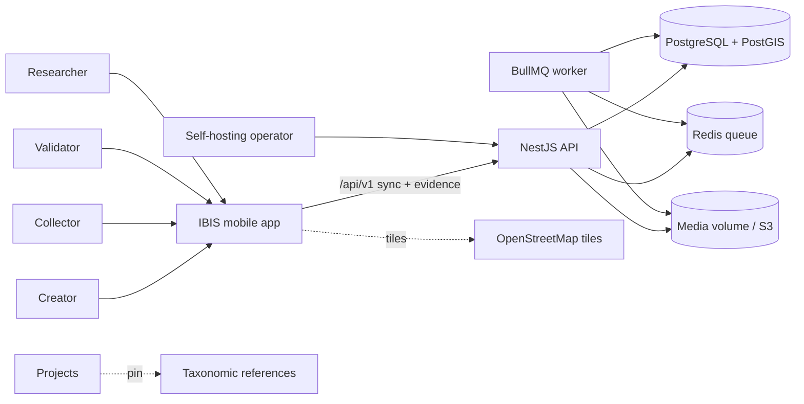
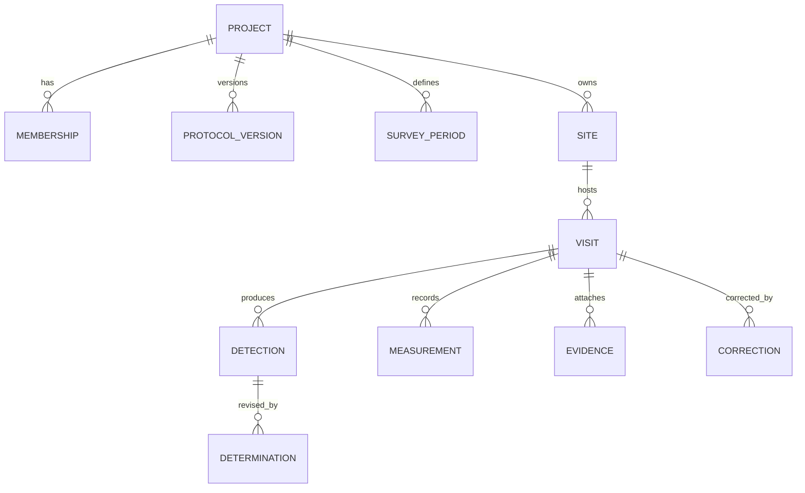
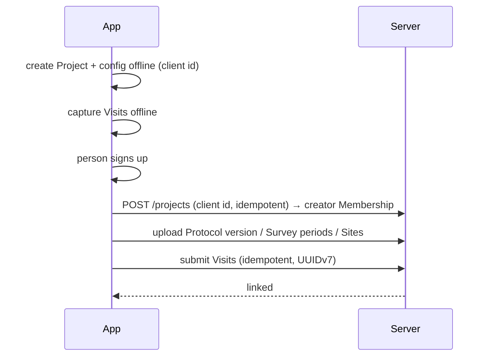
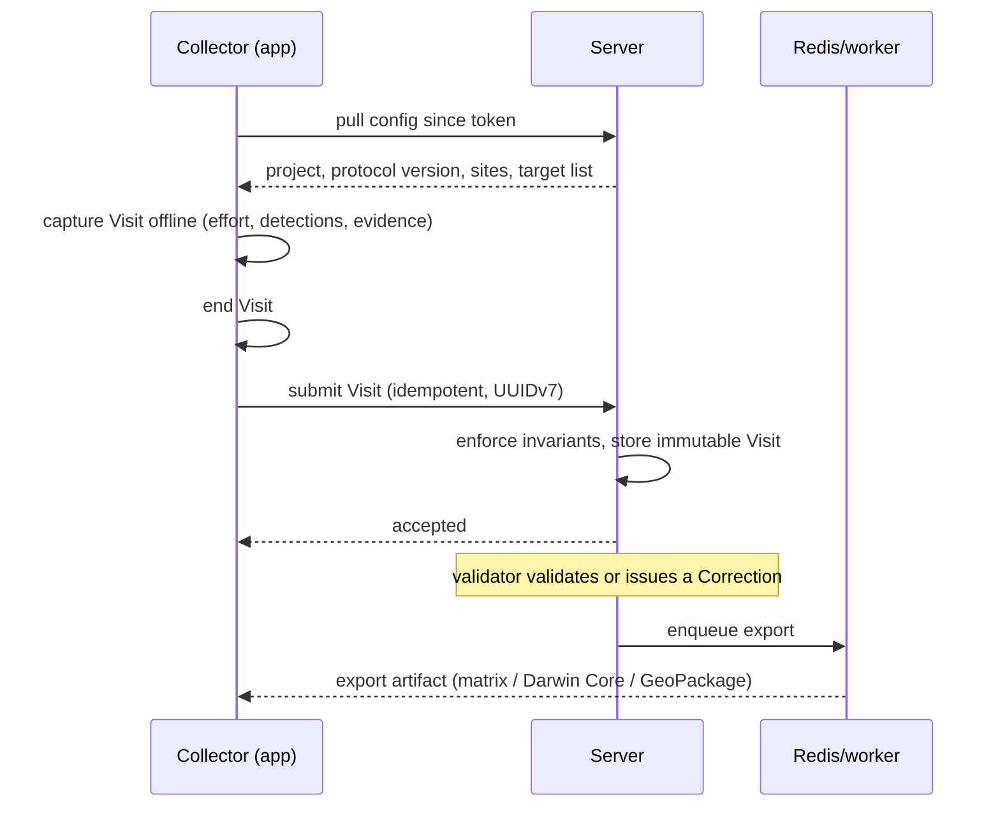
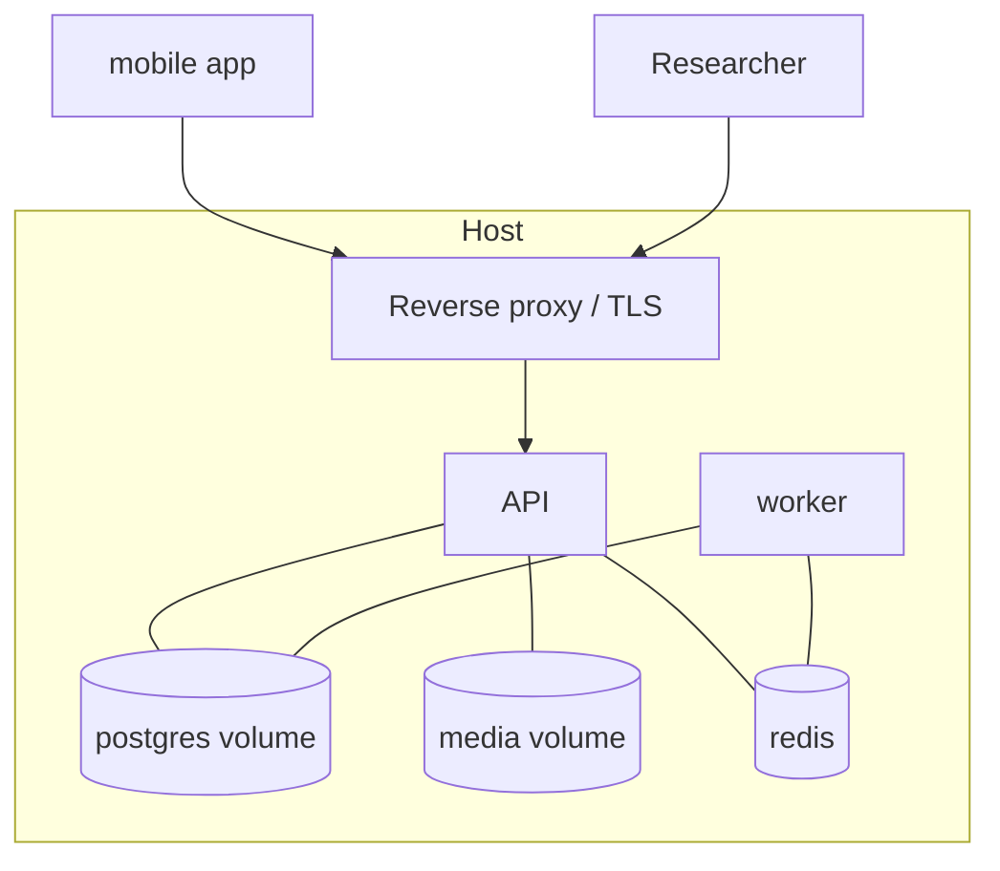

# Architecture: IBIS — Integrated Biodiversity Inventory Survey

## Business context

IBIS turns a project's protocol into the default field workflow: a creator
defines a Project, its Protocol versions, Survey periods, Sites and Target
list; collectors capture Visits offline and submit them; submitted Visits are
immutable and change only through Corrections; validators may validate them;
researchers export occupancy- and GBIF-ready data. A creator may work with no
account — creating a Project and capturing Visits locally — and sign up later,
linking that local data to the new account. Recurring vocabulary is defined in
`GLOSSARY.md` and the model in `DOMAIN.md` — this document maps them onto
modules and persistence, and never restates them.

## Quality attributes

Ranked; the top one breaks ties everywhere below.

1. **Offline reliability & data integrity** — no Visit or Detection is lost on the device, and submitted data stays trustworthy and auditable.
2. **Non-devops deployability & operability** — the whole server is one Compose stack an operator can run and upgrade.
3. **Field performance & battery on low-end devices** — the capture loop stays responsive during long sessions.
4. **Privacy & security** — collector data is personal data (GDPR) and sensitive-taxa locations are a conservation risk.

## Assumptions & constraints

- One developer, one repository; a self-hosted single-host deployment.
- Devices are offline for whole days; the server may be one release behind the app.
- Low-end Android has no barometer: every sensor-backed field falls back to manual entry.
- Protocol definition is shared across Dart and TypeScript (ADR-0009).
- Postgres 18 + PostGIS, Redis, and Node; media on a volume with optional S3 (ADR-0007).

## System view

A Flutter client talks to a self-hosted NestJS modular monolith over a
versioned REST sync API. The same server image also runs as a BullMQ worker
consuming Export jobs from Redis. Postgres/PostGIS is the system of record;
evidence files live in a volume or an optional S3 backend.

## Module map (container view)

Each module names the `DOMAIN.md` aggregates it owns; an aggregate has exactly
one owner. Client modules own no **server-authoritative** aggregate; a
locally-created Project (until linked), an in-progress Visit, and a
field-created Site exist on the device until linked or submitted.

### Client — `app/` (Flutter)

| Module | Responsibility | Interface | Owns |
|---|---|---|---|
| `shell` | App shell with project-scoped routing (Projects at the top level, Account in the app bar) and the persistent system-state indicator; design tokens, Riverpod wiring (the foundational Epic) | navigation + theme providers | — |
| `identity` | Better Auth client; current person and their project roles | sign-in/out, session | — |
| `projects` | Own the local Project aggregate: create and edit Project config offline with no account, pull/join existing Projects, seed and own the first-run Example Project and the Project cards/description — Protocol version, Survey periods, Target list, Sites | config + creation providers | local Project (until linked) |
| `capture` | Offline Visit capture loop: effort timer, per-target Detection entry, opportunistic taxa, covariates, end Visit | Visit state notifiers | in-progress Visit (local) |
| `sites` | Site list/map display and field Site creation, inside a Project | site editor | field-created Site (local) |
| `help` | In-app manual explaining the core field journey (UX-023) | help screen | — |
| `store` | drift database, schema, forward-only migrations | DAOs | local SQLite schema |
| `sensors` | sensors_plus / geolocator / record / image_picker wrappers + Provenance | measurement/evidence services | — |
| `outbox` | Submission upload, retry/backoff, config pull, and the link/upload of locally-created Projects and their Visits on sign-up | sync orchestration | — |

### Server — `server/` (NestJS, REST)

| Module | Responsibility | Public interface | Owns |
|---|---|---|---|
| `identity` | Better Auth integration; resolves person and Memberships | auth guard, `@CurrentPerson()` | — |
| `projects` | Project setup and config for sync; `POST /projects` takes an optional client-supplied id (idempotent) so a locally-created Project links under its own identity | `/projects`, `/protocol-versions`, `/survey-periods` | Project (with Membership, ProtocolVersion, SurveyPeriod, Target list, settings, pinned TaxonomicReference) |
| `sites` | Site lifecycle | `/sites` | Site |
| `visits` | Idempotent ingest, immutability, corrections, validation | `/visits`, `/visits/:id/corrections` | Visit (with Detection, Determination, Measurement, Evidence metadata, Correction) |
| `media` | Evidence storage abstraction and upload/download | `/media` | — |
| `exports` | Detection-history matrix, Darwin Core, CSV, GeoPackage (queue jobs) | `/exports` | — |
| `sync` | The versioned transport | `/api/v1/*` controllers | — |
| `worker` | Same image, BullMQ consumer for `exports` | queue consumer | — |

### Shared — `packages/protocol/` (TypeScript + Dart codegen)

Protocol definition format: TS types + JSON Schema, generated Dart, and golden
fixtures. No runtime aggregate.

## Data model

Persistence per aggregate; enforcement locus is recorded per `INV-` in
`DOMAIN.md`. Structural rules are Postgres constraints; rule-heavy rules run
in server code inside a transaction (ADR-0010).

- **Project** → `project` (nullable `description`, settings jsonb, pinned taxonomic-reference id + version), `membership`, `protocol_version` (document jsonb, `frozen_at`), `survey_period`. The `project.id` is the client-assigned UUIDv7 for a locally-created Project, or the server-generated id for one created online (ADR-0014). An **Example Project** is never synced, so its `example` flag is client-only and no server column exists for it (INV-017, ADR-0016).
- **Site** → `site` with `geom geometry(Geometry, 4326)` and `origin` enum; `site_measurement` for site covariates.
- **Visit** → `visit` (project/site/survey_period/protocol_version FKs, `state` enum, effort jsonb, timestamps, validation fields); `detection` (unique per target taxon per Visit, `opportunistic` flag); `determination` (`replaces_id` self-reference for append-only revisions); `measurement` (value, unit, `provenance` jsonb, owner = visit or detection); `evidence` (storage key + `sha256`, immutable); `correction` (author, reason, payload jsonb, append-only).
- **Constraints**: FKs, `state` enums, `CHECK` on non-negative counts, `ST_IsValid`/SRID checks, partial unique index `(visit_id, taxon_ref) WHERE NOT opportunistic`.
- **Immutability & append-only** (INV-001, INV-009): no UPDATE path for a submitted Visit, Determination or Correction in application code.
- **Provenance** (INV-010): `provenance.method` NOT NULL whenever a `measurement` row exists.
- **Sensitive coordinates** (INV-011): true geometry is stored; obfuscation happens in the read/export layer, never in storage.
- **Client local store** (drift, ADR-0002): owns one local **Project** aggregate — `projects` with its `protocol_versions`, `survey_periods`, and `sites` — populated by offline creation and the config pull alike; there is no separate pull-cache copy. `projects` also carries the synced `description` and the client-only `example` flag. A locally-created Project keeps its client-assigned identity when linked (INV-015); an Example Project is never linked or exported (INV-017).
- **Auth tables** are owned by Better Auth, co-located in Postgres via Drizzle.

## Compatibility surfaces

| Surface | Paths | Other side & skew tolerated | Rule | Proof owed |
|---|---|---|---|---|
| Sync REST API | `server/src/sync/**`, `app/lib/outbox/**` | app ↔ server; server may be one release behind | `/api/v1`, additive only, unknown fields ignored | contract tests both sides (OpenAPI + client) |
| Projects API | `server/src/projects/**`, `app/lib/projects/**` | app ↔ server | additive; `POST /projects` accepts an optional client-supplied id (idempotent create-or-return); a nullable `description` is additive | contract tests both sides |
| Protocol format | `packages/protocol/**` | app ↔ server | versioned; additive changes extend; Project pins a version | golden fixtures validated in Dart and TS |
| Client schema | `app/lib/store/**` | device upgrades | forward-only migrations | migration test from each prior version |
| Server schema | `server/drizzle/**` | operator upgrades | forward-only migrations | migration test on a populated DB |
| Export formats | `server/src/exports/**` | analysts, GBIF | stable per format version; additive columns | golden fixtures |
| Media | `server/src/media/**` | volume/S3 | content-hashed keys, never mutated | upload + hash test |

## Key flows

**Authentication.** The client signs in against Better Auth; the API resolves
the person and their Memberships on every request via the auth guard. Roles
are project-scoped, never global. Signing in is never required to create a
Project or capture a Visit (INV-016).

**Accountless journey.** A creator with no account creates a Project locally
(client-assigned UUIDv7 identity, INV-015) and captures Visits offline; its
Protocol version, Survey periods and Sites are local. Nothing reaches the
server.

**Onboarding.** On first launch, while the person has no non-example Project,
the client seeds an Example Project (`projects` module): a flagged local
Project that is browsable but never linked or exported (INV-017), with a
streamlined in-app manual from the `help` module (UX-018, UX-023). The person
may browse it, delete it, or create their own Project; once a non-example
Project exists the example is no longer seeded.

**Link journey.** On sign-up, the client outbox links the local data:
`POST /projects` with the client id creates the Project server-side and a
single creator Membership (INV-014, INV-016), the config uploads, then the
Visits submit idempotently on their UUIDv7 ids.

**Primary journey (linked project).**

## Cross-cutting concerns

- **Error handling**: one error shape on the API; the client outbox retries with backoff and is idempotent on UUIDv7 ids (ADR-0011), including the link upload.
- **Logging/observability**: structured logs; `GET /healthz` (liveness) and `/readyz` (DB + Redis); queue depth visible to the operator.
- **Config/environments**: environment variables via Compose — DB/Redis URLs, Better Auth secret, optional S3 keys, tile URL.
- **Security boundaries**: internet → API (TLS terminated by the operator's reverse proxy), API → Postgres/Redis internal only; authn via Better Auth, authz via project Membership; sensitive coordinates obfuscated before leaving the server (INV-011).

## Deployment view

- **Local dev**: `docker compose up` (Postgres/PostGIS, Redis, server, worker) plus the Flutter app on a device/emulator.
- **Production (self-hosted)**: one Linux host running the Compose stack from GHCR images, with persistent volumes for the database and media and an operator-provided reverse proxy for TLS; optional MinIO for S3.

## Operational view

- **Observability**: health endpoints and logs only; no external APM at v1.
- **Incident handling**: restart the stack; failed export jobs are retried from Redis.
- **Backup/recovery**: documented `pg_dump`/`pg_restore` and a media-volume snapshot, with a restore procedure in the operator docs.
- **Capacity**: sized for a project-scale single host; revisit at media or visit-volume thresholds.

## Key decisions

- Modular monolith NestJS plus a BullMQ worker for Exports (ADR-0008).
- Protocol format shared through `packages/protocol` with Dart codegen (ADR-0009).
- Invariants: DB constraints where cheap, application rules for the rest, minimal triggers (ADR-0010).
- Versioned additive `/api/v1`, idempotent UUIDv7 submission, append-only corrections (ADR-0011).
- Evidence uploaded through the API, presigned S3 when configured (ADR-0012).
- Hosting via Docker Compose + GHCR (ADR-0006); storage volume by default with optional S3 (ADR-0007).
- Local-first Projects: client-assigned identity, linked on sign-up (ADR-0014).
- Project-scoped client navigation: Projects at the top level, a Project the hub for its Sites, Visits and config (ADR-0015).
- First-run Example Project: a flagged, client-only seeded Project, never linked or exported, with an optional synced Project `description` (ADR-0016).

## Open questions

- Whether a new Project has validation enabled or disabled by default (the setting itself is designed; the default is not).
- Person identity options to expose at sign-in (email/password only, or also OAuth).
- Export artifact retention and where downloads live (volume vs streamed).
- Self-hosted tile server threshold under the OSM usage policy.

## External references

- Darwin Core (Event, Occurrence, `occurrenceStatus`) and the Humboldt extension.
- `docs/adr/` for the full reasoning behind each pinned decision.
