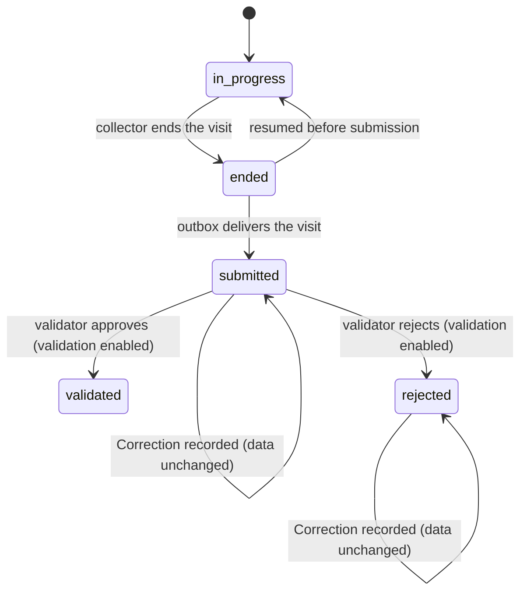

# Domain: IBIS — Integrated Biodiversity Inventory Survey

The model of the problem, independent of any technology. `/architect` maps it
onto modules, `/decompose` writes criteria against it, `/plan` and
`domain-review` hold every sub-task to it.

## Purpose & boundaries

This model covers the collaborative detection/non-detection survey: defining a
project and its protocol, recording where and when surveys happen, capturing a
visit and its detections offline, submitting it immutably, correcting and
validating it, and exporting analysis-ready data.

Capture is decoupled from taxonomic resolution: a Visit may be captured and its
Detections recorded as provisional taxa before the Project pins a Taxonomic
reference. Resolution is a precondition of submission, not of capture, so no
field work is blocked; rigor is enforced at submission and export.

It **references but does not own**:

- **Taxonomic references** — external, versioned species checklists. A project
  pins one version; the version is recorded with the data.
- **People** — a Membership references a person; identity and authentication
  are out of this model.
- **External vocabularies** — Darwin Core and the Humboldt extension, below.

One context is enough: there is one language for a survey, regardless of taxon
or future method.

## Contexts

- **Detection survey** — everything in this document.

## Model

### Project (aggregate)

- identity: assigned at creation and never changes — by the client (a UUIDv7)
  when the Project is created offline, or by the server when it is created
  online. Linking a locally-created Project to an account preserves that
  identity.
- holds: Memberships (role: creator, collector, or validator); Protocol
  versions; Survey periods; the Target list or complete-list scope; an optional
  description (short authored text for the Project); an optional objective (the
  research question) and the Analysis spec(s) the Project intends to run; and
  settings — validation on/off, sensitive-taxa coordinate obfuscation, and the
  pinned Taxonomic reference version, which may be unset until the creator
  chooses one. Creation offers a suggested per-group default (plants; fauna
  lists are open) that the creator accepts or defers.
- lifecycle: `active` → `archived`. Archived projects keep their data readable
  and exports reproducible but accept no new visits.
- A Project may be created and populated with Visits with no account. Whether
  it has been linked to a person is a **sync/link state**, not a lifecycle
  state: the lifecycle is the same before and after linking.
- invariants: INV-007, INV-011, INV-015, INV-016, INV-018.

### Protocol version (entity inside Project)

- identity: a stable protocol identity plus a monotonic version number.
- holds: taxonomic scope; target list or complete-list mode; allowed detection
  methods; required effort fields; required visit and site covariates.
- lifecycle: `draft` → `frozen`. A version is frozen the first time any Visit
  references it, and is immutable thereafter; a change creates a new version.
- invariants: INV-007.

### Membership (entity inside Project)

- identity: membership id, referencing an external person identity.
- holds: the single role the person holds in this project (creator, collector,
  or validator). A person has at most one Membership per project.
- invariants: INV-014.

### Survey period (entity inside Project)

- identity: an identity assigned when the creator defines it.
- holds: a name and a date range.
- Visits to the same site within the same survey period are its repeat visits.
- The Survey period is the **closure window** for a closed occupancy analysis:
  its repeat Visits are assumed to sample the same occupancy state. An analysis
  that assumes closure must warn when repeats exceed a taxon-plausible window.

### Site (aggregate)

- identity: an id assigned by the creator, or generated on the device when a
  collector creates the site in the field.
- holds: geometry (point, line, or polygon); its origin (`planned` or `field`);
  site covariates with their provenance; the creator and time.
- lifecycle: `created` → `active` → `archived`.
- invariants: INV-012.

### Visit (aggregate)

The unit of offline capture, submission, and immutability.

- identity: a client-generated UUIDv7.
- holds: the sampling effort; visit-level covariates with provenance;
  one Detection per target taxon (or, in complete-list mode, per in-scope
  taxon); opportunistic detections; Evidence; Determinations; Measurements;
  and, once submitted, Corrections.
- references: exactly one Site at capture; exactly one Survey period and one
  Protocol version are required before submission (INV-006).
- lifecycle: `in progress` (on the device, effort timer running) → `ended` →
  `submitted` (immutable) → `validated` or `rejected` when the project has
  validation enabled. When validation is disabled, `submitted` is terminal. A
  Visit may be captured and ended with only a Site, but cannot be submitted
  until it has exactly one Survey period and one Protocol version, its required
  effort is recorded (INV-005), its Project has a pinned Taxonomic reference,
  and every Detection's taxon is resolved (INV-008).
- invariants: INV-001 – INV-006, INV-008 – INV-010, INV-013.

### Detection (entity inside Visit)

- identity: within its Visit.
- holds: a taxon resolved against the pinned reference, or a provisional taxon
  pending resolution; `detected` true or false; the detection method; an
  optional count; references to Evidence; any Determinations.
- A non-detection is a Detection with `detected = false` — never a missing
  record. A non-detection requires a resolved target list, so a Visit whose
  taxa are still provisional records opportunistic presence only.

### Determination (entity inside Visit)

- identity: within its Detection; revisions are new Determinations.
- holds: taxon, qualifier (`cf.` / `aff.` / `sp.`), specimen code, determiner,
  date, and a link to the Determination it replaces.
- Append-only: a revision links to the one it replaces; nothing is overwritten.
- invariants: INV-009.

### Measurement (value)

- holds: a value, a unit, and the Measurement's Provenance.
- invariants: INV-010.

### Provenance (value)

- holds: method (phone sensor, field instrument, or visual estimate); device or
  instrument make and model; calibration state; uncertainty; observer; time.

### Evidence (entity inside Visit)

- holds: a photo or audio recording. Immutable once attached to a Visit.

### Covariate (definition + value)

- a **definition** lives in a Protocol version: name, type, unit.
- a **value** lives on a Site or a Visit, paired with its Provenance.

### Correction (entity — append-only, on a submitted Visit)

- holds: author, time, reason, and the change it carries.
- Never mutates the submitted Visit; it is the only way a submitted record
  changes in effect.
- invariants: INV-001, INV-013.

### Analysis spec (value)

- A declarative, versioned definition of an analysis a Project may run: the
  question it answers; the data shape it requires (repeat Visits, closure,
  required effort and covariates, completeness); the target tool; and the
  bundle it emits.
- Selected by a Project; never owned by one. Declarative data, not code: an
  Analysis spec is never executed by IBIS and never alters captured data.
- source: occupancy/detection modelling (`unmarked`; MacKenzie et al.).
- invariants: INV-018.

### Provisional taxon (value)

- A taxon recorded on a Detection before the Project's pinned Taxonomic
  reference is available: a name or abbreviation not yet resolved to a
  reference taxon. It is presence-only, and is resolved against the pinned
  reference before the Visit is submitted (INV-008).
- It is not a Determination qualifier (`cf.` / `aff.` / `sp.`), which revises
  an already-resolved assignment.
- source: Darwin Core Occurrence, which permits a `scientificName` with no
  resolved `taxonID`.

## Invariants

| ID | Rule (falsifiable) | Aggregate | Enforced at |
|---|---|---|---|
| INV-001 | A submitted Visit is never edited; every later change is a Correction carrying author, time, and reason. | Visit | both |
| INV-002 | A Visit cannot be submitted until every target taxon has a Detection; "not recorded" and "not detected" are distinct states. | Visit | both |
| INV-003 | An opportunistic Detection outside the target list is presence-only and never implies a non-detection anywhere. | Visit | both |
| INV-004 | A complete-list Visit declares its taxonomic scope; only in-scope, unrecorded taxa count as non-detections. | Visit | both |
| INV-005 | A Visit records the sampling-effort fields its Protocol version requires: start, duration, observers, detection methods. | Visit | both |
| INV-006 | A **submitted** Visit belongs to exactly one Site, one Survey period, and one Protocol version; capture requires only the Site. | Visit | both |
| INV-007 | A Protocol version referenced by any Visit is immutable; changes create a new version. | Project | server |
| INV-008 | Taxon names resolve against the pinned Taxonomic reference version **before submission**; that version is stored with the submitted data. A Detection still holding a provisional taxon, or a Visit whose Project has no pinned reference, cannot be submitted. | Visit / Project | both |
| INV-009 | A Determination is never overwritten; a revised one links to the one it replaces. | Visit | both |
| INV-010 | Every Measurement carries its Provenance; a value without a method is invalid. | Visit / Site | both |
| INV-011 | Sensitive-taxa coordinates never leave the server unobfuscated, except to roles the Project allows. | Project | server |
| INV-012 | A Site belongs to exactly one Project and records whether it was planned or field-created. | Site | both |
| INV-013 | Validation, when enabled, applies only to a submitted Visit; a rejected Visit keeps its submitted data and gets a Correction, never deletion. | Visit | server |
| INV-014 | A person has at most one Membership in a project, holding exactly one role. | Project | server |
| INV-015 | A Project's identity is assigned at creation — by the client when created offline — and never changes; linking preserves it. | Project | both |
| INV-016 | Creating a Project and capturing Visits require no account; linking them to a person creates exactly one creator Membership (INV-014). | Project | both |
| INV-018 | An Analysis spec is declarative: selecting or applying one never modifies captured Project data and never runs author-supplied code; analysis output is derived and never authoritative. | Project | client |

## Events

| Event | Raised when | Carries | Consumers |
|---|---|---|---|
| Visit ended | the collector ends the visit | visit id, end time | client (outbox) |
| Visit submitted | the outbox delivers the visit | the visit, its Site/Survey period/Protocol version references, evidence manifest | server (lock, export), validators |
| Correction recorded | a collector or validator changes a submitted visit | visit ref, author, time, reason, change | export/derived views |
| Determination revised | a new Determination supersedes one | detection ref, replaced and replacement Determinations, author, time | audit |
| Visit validated | a validator approves a submitted visit | visit ref, validator, time | project consumers |
| Visit rejected | a validator rejects a submitted visit | visit ref, validator, time, reason | collector (Correction) |
| Protocol version frozen | the first Visit references a version | protocol id, version | server |
| Project linked | a person links a locally-created Project to their account | project identity, person | server (Membership), client (outbox) |

## Policies

- When a **Visit is submitted**, require it to carry exactly one Survey period
  and one Protocol version, its required effort, a pinned reference on the
  Project, and a resolved taxon on every Detection; locking it immutable and,
  if validation is enabled, exposing it to validators happens only then.
- When a **Project has no pinned Taxonomic reference**, capture proceeds and
  Detections hold provisional taxa; submission is blocked until a reference is
  pinned and every taxon resolves.
- When a **Project pins or changes its Taxonomic reference**, re-resolve its
  provisional taxa; already-submitted data keeps the version stored with it
  (INV-008) and is never retroactively changed.
- When a **Correction is recorded**, re-derive every affected export and view;
  never mutate the submitted record.
- When a **Determination is revised**, link the replacement to the one it
  replaces and record author, time, and reason.
- When a **Protocol version is first referenced by a Visit**, freeze it.
- When **validation is disabled** in a Project, a submitted Visit is terminal.
- When a **Project is linked** to a person, store it under its existing
  identity, create exactly one creator Membership, and upload its Visits.
- When a **Project selects an Analysis spec**, surface the spec's data
  requirements as design-time guidance and an export readiness check; warn or
  gate on identifiability, but never block capture.

## Provenance & audit

Who, when, and how is traceable for every visit, detection, and measurement.
Determinations carry their determiner and date and link to the ones they
replace. Corrections carry author, time, and reason. Submitted Visits and
Protocol versions are immutable, and their history is retained; nothing is
deleted to fix a mistake. Linking a locally-created Project records who linked
it and when; the Project's identity is unchanged by the link. A provisional
taxon is replaced by its resolved taxon before submission, and the reference
version it resolved against is stored with the submitted data.

## External vocabularies

- **Darwin Core** — Event, Occurrence, `occurrenceStatus` (present/absent).
  An Occurrence may carry a `scientificName` with no resolved `taxonID`; a
  provisional taxon is that state made explicit and resolved before submission,
  never exported unresolved.
- **Humboldt extension** — effort and scope terms.
- **Taxonomic references** — per group, versioned and pinned per project; the
  Italy vascular-flora checklist is named, fauna lists are open.
- **Occupancy/detection modelling** — `unmarked` (Fiske & Chandler 2011) and
  the MacKenzie et al. occupancy literature: the analysis framework the
  occupancy Analysis spec rests on; the analysis itself runs externally.
- Deliberate departure: a non-detection is a Detection with
  `detected = false`; "absence" is an inference an analysis makes, not a fact
  the field records, and is not a term here.
- "Plot" is reserved for the vegetation relevé in the Next scope and is not a
  synonym of Site.

## Open questions

- Fauna taxonomic references: which lists, their licences, and their update
  cadence.
- Taxonomic-reference granularity and versioning per group.
- Which per-group default reference is suggested at Project creation (plants
  named; fauna lists are open).
